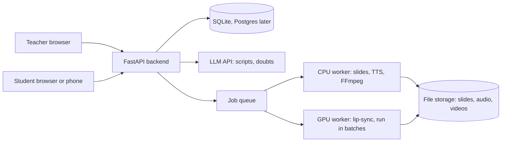

# ClassMitra: design

## Architecture

The website is static (GitHub Pages). All secrets and heavy work stay on the backend.

## Key decisions

| Decision | Why | Trade-off |
|---|---|---|
| Static frontend plus separate API | Free hosting, simple, easy to test the API alone | Needs CORS configured |
| Render videos ahead of time, never live | Students never wait for a GPU | Edits need a re-render of changed slides only (cache) |
| Prepared explanations per slide | Doubt answers play instantly | Extra LLM calls at upload time |
| Teacher approves call-outs and complaints | AI attention scores can be wrong | Slower than fully automatic |
| Attendance = person check + place check | A QR sent to a phone proves who, not where | More moving parts (rotating code, Wi-Fi check) |
| Free-first, engine switch (free / rented GPU / hosted API) | Start at $0, upgrade later without a rewrite | Free GPU is slow and limited |
| Secrets only in backend `.env` | Anything in JS can be read by anyone | Need a server to call paid or keyed APIs |

## Data model (planned, Phase 1)

Department -> Class -> Division -> Subject -> Lesson -> Slide (script, audio, video, cached by content hash).
Student (roll number, division, registered device). AttendanceSession (subject, start, rotating secret) -> AttendanceRecord.
Doubt (slide, question, answer, was it resolved).

## API plan

| Phase | Endpoints |
|---|---|
| 0 | GET /api/health, GET /api/config-check, GET /api/departments, GET /api/departments/{id} |
| 1 | CRUD for classes, divisions, subjects, students |
| 2-3 | POST /api/lessons (upload PPT), GET /api/lessons/{id}, per-slide script edit |
| 4 | POST /api/attendance/sessions, GET .../code, POST .../check-in |
| 5 | POST /api/doubts |
| 6 | attention features and classifier results |
